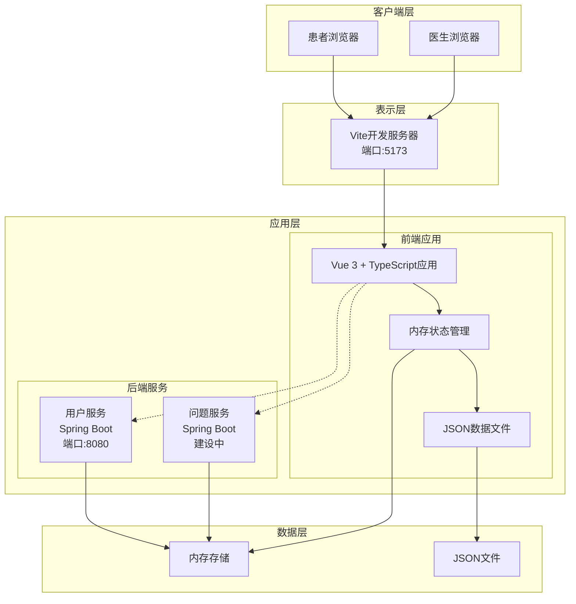
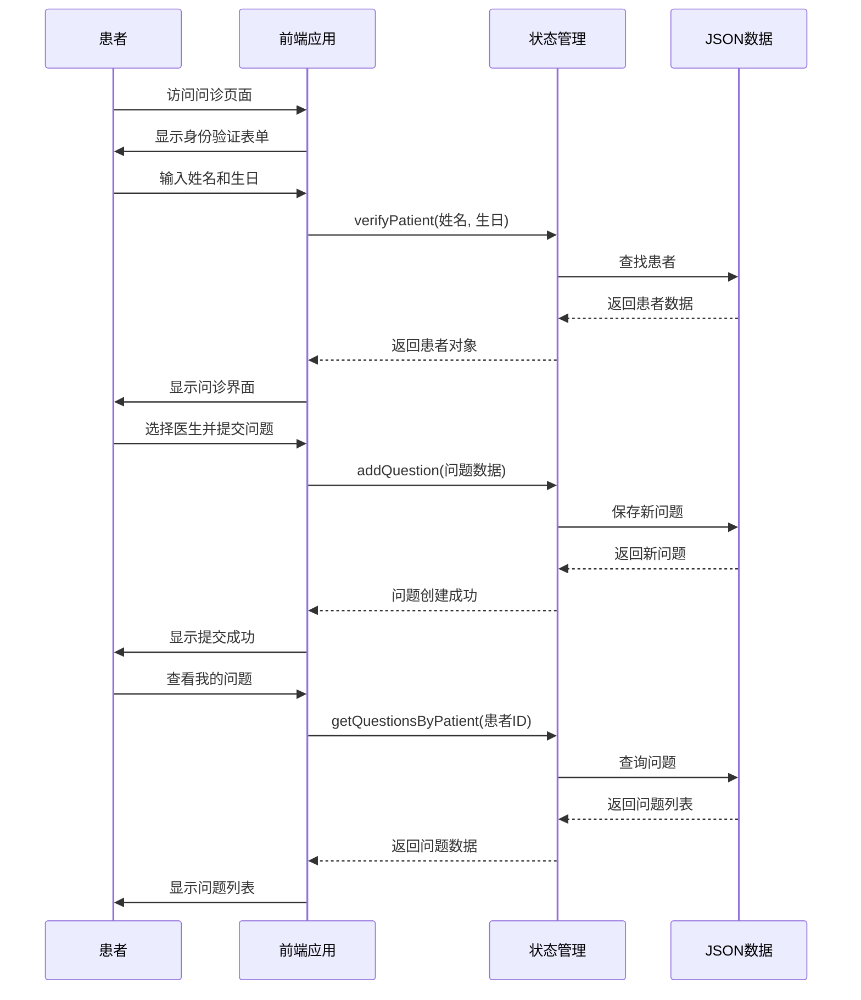
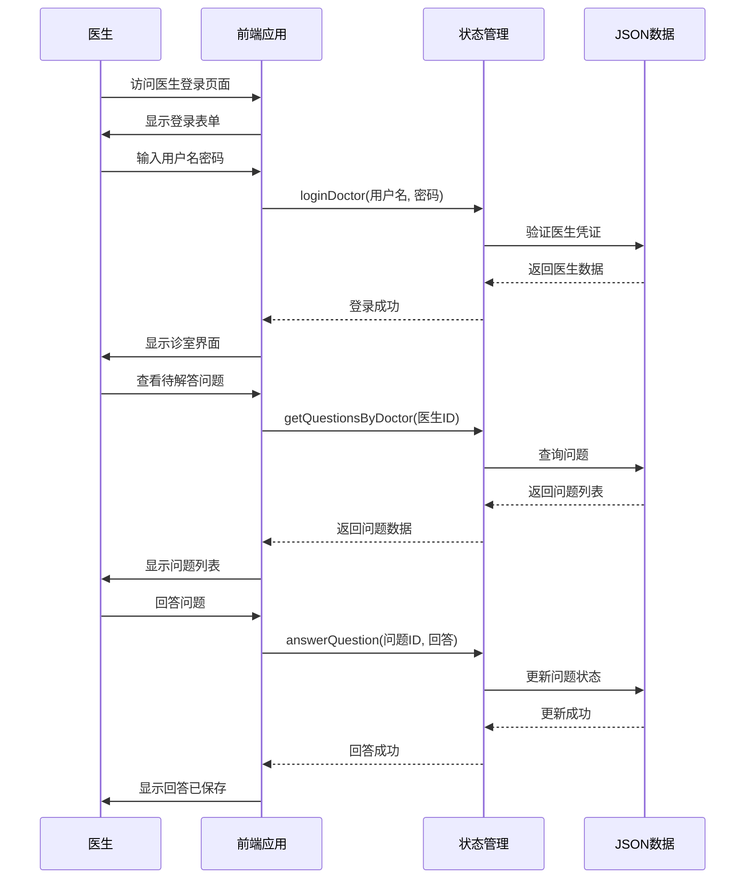
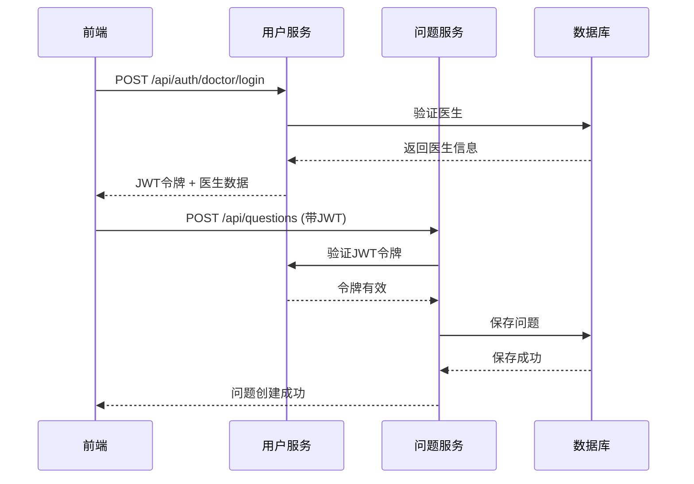
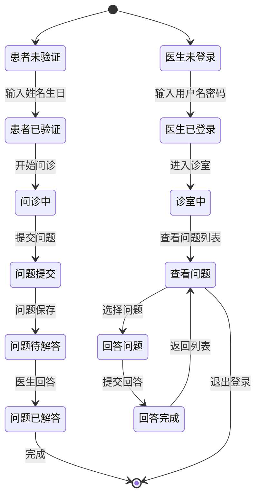
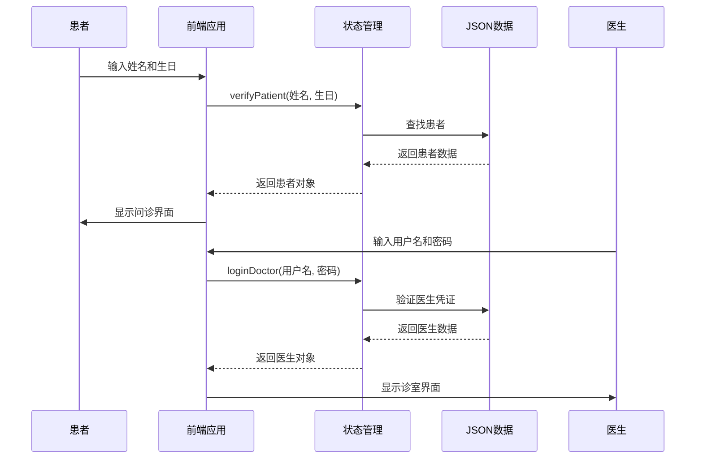
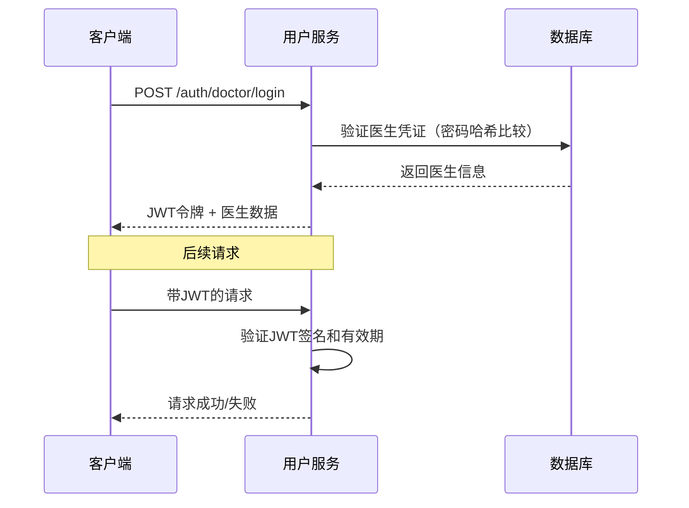
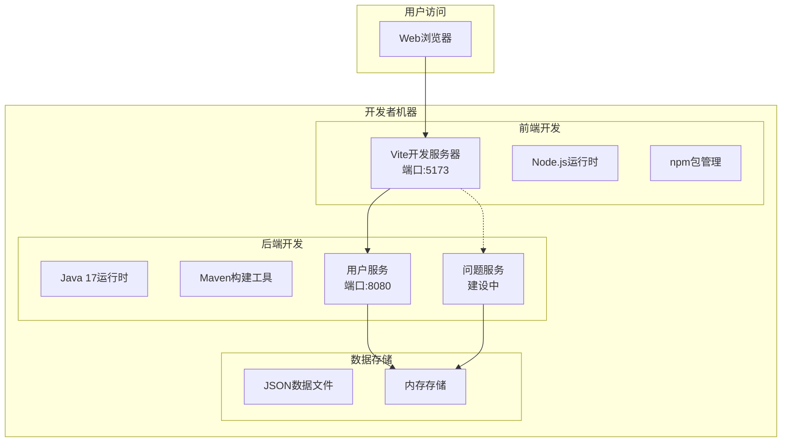
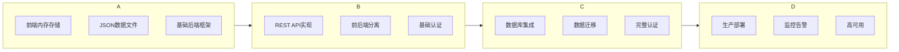

# 系统架构

## 概述
本文档描述了此工作空间的整体系统架构、设计决策和技术模式。它为AI模型提供了对系统结构和设计原则的全面理解。

**当前项目状态**: 这是一个医疗问诊平台的**原型系统**，采用前后端分离架构，前端使用Vue 3 + TypeScript，后端使用Spring Boot微服务框架。当前版本为v0.1.0开发版本，前端使用内存存储模拟API调用，后端提供基础框架和CORS配置。

## 架构概览

### 高层架构图


## 架构原则

### 1. 关注点分离
- **表示层**: Vue 3前端应用，处理用户交互
- **应用层**: 前端状态管理 + 后端Spring Boot服务
- **数据层**: 内存存储 + JSON文件（当前原型阶段）

### 2. 前后端分离
- 前端独立开发，使用Vite构建工具
- 后端提供REST API接口（建设中）
- 通过HTTP/HTTPS通信
- CORS配置支持跨域请求

### 3. 原型优先设计
- 快速验证核心业务流程
- 前端使用内存存储模拟完整功能
- 后端逐步实现API接口
- 数据模型先行，API后补

### 4. 渐进式演进
- 从内存存储到数据库存储
- 从模拟API到真实API
- 从单体应用到微服务
- 从原型到生产系统

## 组件详情

### 前端应用 (Vue 3 + TypeScript + Ant Design Vue)
**用途**: 提供患者和医生的完整用户界面，包含所有业务逻辑

**技术栈**:
- Vue 3.5.10 (Composition API)
- TypeScript 5.5.3
- Vite 5.4.8 (构建工具)
- Ant Design Vue 4.2.6 (UI组件库)
- Vue Router 4.6.3 (路由)
- Day.js 1.11.19 (日期处理)

**架构特点**:
- 基于组件的架构，模块化开发
- 响应式状态管理（Vue reactive）
- 客户端路由，支持深链接
- 内存状态管理，模拟完整业务逻辑
- JSON文件作为数据源

**核心模块**:
1. **患者问诊模块** (`Consultation.vue`): 患者身份验证、医生选择、问题提交
2. **医生诊室模块** (`DoctorRoom.vue`): 医生登录、问题管理、回答功能
3. **状态管理模块** (`store/index.ts`): 完整业务逻辑实现
4. **数据模块** (`data/`目录): JSON格式的模拟数据

### 用户服务 (qa-service-user)
**用途**: Spring Boot后端服务，提供用户管理API（当前为CORS测试）

**技术栈**:
- Spring Boot 3.5.7
- Java 17
- Spring Web
- Spring Actuator

**当前状态**:
- 基础框架已搭建
- CORS配置已完成
- 测试端点可用 (`/api/test/cors`)
- 完整用户API待实现

**端口**: 8080

### 问题服务 (qa-service-question)
**用途**: Spring Boot后端服务，提供问题管理API（建设中）

**技术栈**:
- Spring Boot 3.5.7
- Java 17
- Spring Web
- Testcontainers (测试)

**当前状态**:
- 基础框架已搭建
- 完整问题API待实现

### 统计服务 (qa-service-statistic)
**用途**: Spring Boot后端服务，提供统计分析API（规划中）

**当前状态**:
- 目录结构已创建
- 代码待实现

### 前端状态管理 (Store)
**用途**: 模拟完整业务逻辑，提供内存数据存储

**位置**: `web/qa-web/src/store/index.ts`

**功能**:
- 医生登录/登出
- 患者身份验证
- 问题管理（提交、回答、查询）
- 数据统计
- 内存数据持久化

**数据源**:
- `doctor-user-list.json`: 医生数据
- `patient-user.json`: 患者数据  
- `question-list.json`: 问题数据

**接口**:
```typescript
export const store = {
  // 医生相关
  loginDoctor(username: string, password: string): Doctor | null;
  logoutDoctor(): void;
  getDoctorByUsername(username: string): Doctor | undefined;
  getActiveDoctors(): Doctor[];
  
  // 患者相关
  verifyPatient(name: string, birthday: string): Patient;
  logoutPatient(): void;
  
  // 问题相关
  getQuestionsByDoctor(doctorId: string): Question[];
  getQuestionsByPatient(patientId: string): Question[];
  addQuestion(question: Omit<Question, 'id' | 'submitTime' | 'status' | 'answer' | 'answerTime'>): Question;
  answerQuestion(questionId: string, answer: string): void;
  markQuestionAsAnswered(questionId: string): void;
  
  // 统计相关
  getStatistics(): Statistics;
}
```

## 数据流模式

### 患者问诊流程（当前实现）


### 医生工作流程（当前实现）


### 前后端通信流程（未来实现）


### 状态转换图


## 设计模式

### 状态管理模式（当前实现）
**位置**: `web/qa-web/src/store/index.ts`

**模式**: 集中式状态管理，类似于Vuex/Pinia的简化实现

**特点**:
- 单一数据源（store.state）
- 响应式状态（Vue reactive）
- 纯函数操作（无副作用）
- 类型安全（TypeScript接口）

**实现**:
```typescript
// 1. 定义状态接口
interface State {
  doctors: Doctor[];
  patients: Patient[];
  questions: Question[];
  currentDoctor: Doctor | null;
  currentPatient: Patient | null;
}

// 2. 创建响应式状态
const state = reactive<State>({
  doctors: doctorData as Doctor[],
  patients: patientData as Patient[],
  questions: questionData as Question[],
  currentDoctor: null,
  currentPatient: null,
});

// 3. 定义操作方法
export const store = {
  state,
  
  // 医生登录
  loginDoctor(username: string, password: string): Doctor | null {
    const doctor = state.doctors.find(
      d => d.username === username && d.password === password
    );
    if (doctor) {
      state.currentDoctor = doctor;
      return doctor;
    }
    return null;
  },
  
  // 患者验证
  verifyPatient(name: string, birthday: string): Patient {
    let patient = state.patients.find(
      p => p.name === name && p.birthday === birthday
    );
    
    if (!patient) {
      patient = {
        id: `patient${Date.now()}`,
        name,
        birthday,
        phone: '',
        gender: '',
      };
      state.patients.push(patient);
    }
    
    state.currentPatient = patient;
    return patient;
  },
  
  // 问题管理
  addQuestion(question: Omit<Question, 'id' | 'submitTime' | 'status' | 'answer' | 'answerTime'>): Question {
    const newQuestion: Question = {
      ...question,
      id: `q${Date.now()}`,
      submitTime: new Date().toISOString(),
      status: 'pending',
      answer: null,
      answerTime: null,
    };
    state.questions.push(newQuestion);
    return newQuestion;
  },
  
  // 回答问题
  answerQuestion(questionId: string, answer: string) {
    const question = state.questions.find(q => q.id === questionId);
    if (question) {
      question.status = 'answered';
      question.answer = answer;
      question.answerTime = new Date().toISOString();
    }
  }
};
```

### 组件模式（Vue 3 Composition API）
**位置**: `web/qa-web/src/views/` 目录下的Vue组件

**模式**: 基于组合式API的组件架构

**特点**:
- 逻辑关注点分离
- 更好的类型推断
- 可复用的组合函数
- 响应式数据绑定

**实现**:
```vue
<template>
  <!-- 模板部分：声明式UI -->
  <div class="consultation">
    <div v-if="!currentPatient" class="auth-section">
      <!-- 身份验证表单 -->
    </div>
    <div v-else class="patient-portal">
      <!-- 患者问诊界面 -->
    </div>
  </div>
</template>

<script setup lang="ts">
// 组合式API：逻辑组织
import { ref, reactive, computed, onMounted } from 'vue';
import { useRoute } from 'vue-router';
import { message } from 'ant-design-vue';
import { store } from '../store';

// 响应式状态
const currentPatient = computed(() => store.state.currentPatient);
const myQuestions = computed(() =>
  currentPatient.value
    ? store.getQuestionsByPatient(currentPatient.value.id)
    : []
);

// 表单状态
const authForm = reactive({
  name: '',
  birthday: null as Dayjs | null,
});

// 生命周期钩子
onMounted(() => {
  // 初始化逻辑
});

// 业务方法
const verifyPatient = () => {
  const birthday = authForm.birthday?.format('YYYY-MM-DD');
  if (!birthday) {
    message.error('请选择生日');
    return;
  }
  
  store.verifyPatient(authForm.name, birthday);
  message.success('验证成功!');
};
</script>

<style scoped>
/* 组件作用域样式 */
.consultation {
  min-height: calc(100vh - 64px);
  padding-top: 64px;
  background: #f0f2f5;
}
</style>
```

### 数据访问模式（JSON文件 + 内存存储）
**位置**: `web/qa-web/src/data/` 目录

**模式**: 文件系统作为数据源，内存作为缓存

**特点**:
- 开发环境友好
- 零配置启动
- 数据持久化（页面刷新会重置）
- 易于调试和修改

**实现**:
```typescript
// 1. 数据文件导入
import doctorData from '../data/doctor-user-list.json';
import patientData from '../data/patient-user.json';
import questionData from '../data/question-list.json';

// 2. 类型定义
export interface Doctor {
  id: string;
  username: string;
  password: string;
  name: string;
  title: string;
  department: string;
  avatar: string;
  experience: string;
  specialties: string[];
  isActive: boolean;
}

// 3. 数据访问方法
const getDoctorByUsername = (username: string): Doctor | undefined => {
  return state.doctors.find(d => d.username === username);
};

const getQuestionsByDoctor = (doctorId: string): Question[] => {
  return state.questions.filter(q => q.doctorId === doctorId);
};
```

### 路由模式（Vue Router）
**位置**: `web/qa-web/src/router/index.ts`

**模式**: 客户端路由，支持动态路由参数

**特点**:
- 基于组件的路由配置
- 路由守卫（权限控制）
- 动态路由参数
- 嵌套路由支持

**实现**:
```typescript
import { createRouter, createWebHistory } from 'vue-router';
import Home from '../views/Home.vue';
import Consultation from '../views/Consultation.vue';
import DoctorRoom from '../views/DoctorRoom.vue';

const routes = [
  {
    path: '/',
    name: 'Home',
    component: Home,
  },
  {
    path: '/consultation',
    name: 'Consultation',
    component: Consultation,
  },
  {
    path: '/consultation/:doctorUsername',
    name: 'ConsultationWithDoctor',
    component: Consultation,
    props: true,
  },
  {
    path: '/doctor/:username',
    name: 'DoctorRoom',
    component: DoctorRoom,
    props: true,
    beforeEnter: (to, from, next) => {
      // 路由守卫：检查医生是否已登录
      const username = to.params.username as string;
      const currentDoctor = store.state.currentDoctor;
      
      if (!currentDoctor || currentDoctor.username !== username) {
        next('/doctor/login');
      } else {
        next();
      }
    },
  },
];

const router = createRouter({
  history: createWebHistory(),
  routes,
});

export default router;
```

## 集成模式

### 当前集成模式（内存存储）
**模式**: 前端自包含，无外部依赖

**特点**:
- 零网络延迟
- 离线可用
- 开发环境友好
- 数据一致性保证

**实现**:
```typescript
// 所有数据操作都在内存中完成
const doctor = store.loginDoctor('dr-zhang-wei', '123456');
const patient = store.verifyPatient('赵明', '1980-05-15');
const question = store.addQuestion({
  patientId: patient.id,
  patientName: patient.name,
  doctorId: doctor.id,
  doctorName: doctor.name,
  question: '最近总是感觉胸闷气短...'
});
```

### 未来集成模式（REST API）
**模式**: 前后端分离，通过HTTP通信

**特点**:
- 真正的客户端-服务器架构
- 支持多用户并发
- 数据持久化
- 可扩展性

**实现规划**:
```typescript
// 1. HTTP客户端封装
class ApiClient {
  private baseUrl: string;
  private token: string | null = null;
  
  constructor(baseUrl: string) {
    this.baseUrl = baseUrl;
  }
  
  setToken(token: string) {
    this.token = token;
  }
  
  async loginDoctor(username: string, password: string): Promise<Doctor> {
    const response = await fetch(`${this.baseUrl}/auth/doctor/login`, {
      method: 'POST',
      headers: {
        'Content-Type': 'application/json',
      },
      body: JSON.stringify({ username, password }),
    });
    
    if (!response.ok) {
      throw new Error('登录失败');
    }
    
    const data = await response.json();
    this.setToken(data.token);
    return data.doctor;
  }
  
  async verifyPatient(name: string, birthday: string): Promise<Patient> {
    const response = await fetch(`${this.baseUrl}/patients/verify`, {
      method: 'POST',
      headers: {
        'Content-Type': 'application/json',
        ...(this.token && { 'Authorization': `Bearer ${this.token}` }),
      },
      body: JSON.stringify({ name, birthday }),
    });
    
    if (!response.ok) {
      throw new Error('患者验证失败');
    }
    
    return await response.json();
  }
}

// 2. 服务层集成
const apiClient = new ApiClient('http://localhost:8080/api');

// 替换现有的store调用
const doctor = await apiClient.loginDoctor('dr-zhang-wei', '123456');
const patient = await apiClient.verifyPatient('赵明', '1980-05-15');
```

### CORS配置（当前后端）
**位置**: `server/qa-service-user/src/main/java/com/leansofx/qaserviceuser/config/CorsConfig.java`

**用途**: 允许前端应用跨域访问后端API

**配置**:
```java
@Configuration
public class CorsConfig implements WebMvcConfigurer {
    @Override
    public void addCorsMappings(CorsRegistry registry) {
        registry.addMapping("/**")
                .allowedOriginPatterns("*")
                .allowedMethods("GET", "POST", "PUT", "DELETE", "OPTIONS")
                .allowedHeaders("*")
                .allowCredentials(true)
                .maxAge(3600);
    }
}
```

### 测试端点（当前可用）
**端点**: `GET /api/test/cors` 和 `POST /api/test/cors`

**用途**: 验证CORS配置和基础通信

**响应示例**:
```json
{
  "message": "CORS configuration is working!",
  "timestamp": 1733731200000,
  "service": "qa-service-user"
}
```

## 安全架构

### 当前安全模型（原型阶段）
**状态**: 简化安全模型，适用于原型开发和演示

**特点**:
- 前端内存存储，无网络传输风险
- 明文密码存储（仅用于演示）
- 无持久化数据泄露风险
- 页面刷新后数据重置

### 认证流程（当前实现）


### 授权模型（当前实现）
**基于角色的简单访问控制**:

```typescript
// 当前用户角色
type UserRole = 'DOCTOR' | 'PATIENT' | 'GUEST';

// 路由守卫实现
const router = createRouter({
  history: createWebHistory(),
  routes: [
    {
      path: '/doctor/:username',
      name: 'DoctorRoom',
      component: DoctorRoom,
      beforeEnter: (to, from, next) => {
        const username = to.params.username as string;
        const currentDoctor = store.state.currentDoctor;
        
        // 医生必须已登录且用户名匹配
        if (!currentDoctor || currentDoctor.username !== username) {
          next('/doctor/login');
        } else {
          next();
        }
      },
    },
    {
      path: '/consultation',
      name: 'Consultation',
      component: Consultation,
      // 患者页面无需特殊权限
    },
  ],
});
```

### 数据安全考虑
**当前限制**:
1. **密码存储**: 明文存储在JSON文件中（仅演示用途）
2. **数据传输**: 无网络传输，所有数据在前端内存中
3. **会话管理**: 基于内存状态，页面刷新后失效
4. **数据隔离**: 所有用户共享同一数据源

**改进计划**:
1. **后端认证**: 实现JWT令牌认证
2. **密码加密**: 使用bcrypt进行密码哈希
3. **HTTPS**: 生产环境启用HTTPS
4. **输入验证**: 服务器端输入验证
5. **SQL注入防护**: 使用参数化查询

### 未来安全架构


### 安全最佳实践（计划实现）
1. **最小权限原则**: 每个角色只拥有必要权限
2. **防御性编程**: 验证所有输入，处理所有异常
3. **安全日志**: 记录所有安全相关事件
4. **定期审计**: 定期检查安全配置和代码
5. **依赖安全**: 定期更新依赖包，修复安全漏洞
```

## 性能考虑

### 当前性能特点（原型阶段）
**优势**:
1. **零网络延迟**: 所有数据在内存中，无HTTP请求开销
2. **即时响应**: 数据操作在微秒级别完成
3. **无数据库压力**: 无数据库连接和查询开销
4. **前端优化**: Vue 3响应式系统自动优化渲染

**限制**:
1. **数据规模**: 内存存储限制数据量（适合演示数据）
2. **并发访问**: 单用户场景，不支持多用户并发
3. **持久化**: 页面刷新后数据丢失
4. **扩展性**: 难以扩展到生产环境

### 内存存储性能
**数据操作时间复杂度**:
- 查找: O(n) - 线性搜索（数据量小，性能可接受）
- 插入: O(1) - 数组末尾追加
- 更新: O(n) - 查找后更新
- 删除: O(n) - 查找后删除

**实际性能表现**:
```typescript
// 典型操作耗时（在现代浏览器中）
const start = performance.now();

// 医生登录（查找操作）
const doctor = store.loginDoctor('dr-zhang-wei', '123456');
// 耗时: < 1ms

// 患者验证（查找或创建）
const patient = store.verifyPatient('赵明', '1980-05-15');
// 耗时: < 1ms

// 提交问题（创建操作）
const question = store.addQuestion({ /* 问题数据 */ });
// 耗时: < 1ms

// 获取医生问题列表（过滤操作）
const doctorQuestions = store.getQuestionsByDoctor('doc001');
// 耗时: < 1ms（数据量小）

const end = performance.now();
console.log(`总耗时: ${end - start}ms`); // 通常 < 5ms
```

### 前端渲染性能
**Vue 3优化特性**:
1. **响应式系统**: 细粒度依赖跟踪，最小化重新渲染
2. **虚拟DOM**: 高效的DOM更新算法
3. **Tree-shaking**: 构建时移除未使用代码
4. **代码分割**: 路由级代码分割（Vite自动支持）

**性能优化实践**:
```vue
<!-- 使用计算属性缓存结果 -->
<script setup>
const pendingQuestions = computed(() =>
  store.getQuestionsByDoctor(currentDoctor.value.id)
    .filter(q => q.status === 'pending')
);

// 使用v-for的key优化列表渲染
<template v-for="question in pendingQuestions" :key="question.id">
  <!-- 问题卡片 -->
</template>
</script>
```

### 未来性能优化计划
1. **数据库索引**: 为常用查询字段创建索引
2. **查询优化**: 使用分页、懒加载技术
3. **缓存策略**: 实现多级缓存（内存 + Redis）
4. **CDN加速**: 静态资源使用CDN分发
5. **图片优化**: 使用WebP格式，实现懒加载

### 监控和可观测性（当前状态）
**开发工具**:
1. **Vite DevTools**: 前端开发服务器监控
2. **Vue DevTools**: 组件状态和性能分析
3. **浏览器开发者工具**: 网络、性能、内存分析
4. **Spring Boot Actuator**: 后端健康检查（端口8080）

**可用监控端点**:
```bash
# 后端健康检查
curl http://localhost:8080/actuator/health

# 响应示例
{
  "status": "UP",
  "components": {
    "diskSpace": {
      "status": "UP",
      "details": {
        "total": 500000000000,
        "free": 300000000000,
        "threshold": 10485760
      }
    },
    "ping": {
      "status": "UP"
    }
  }
}
```

### 日志记录（当前实现）
**前端日志**:
```typescript
// 控制台日志（开发环境）
console.log('医生登录:', doctor);
console.warn('密码明文存储，仅用于演示');
console.error('登录失败:', error);

// 用户反馈
import { message } from 'ant-design-vue';
message.success('登录成功');
message.error('用户名或密码错误');
```

**后端日志**:
- Spring Boot默认日志配置
- 控制台输出日志
- 日志级别: INFO（默认）

### 未来监控规划
1. **应用指标**: Prometheus + Grafana监控
2. **分布式追踪**: Jaeger或Zipkin
3. **日志聚合**: ELK Stack或Loki
4. **错误监控**: Sentry或Bugsnag
5. **性能监控**: Lighthouse + Web Vitals

## 部署架构

### 当前部署模式（本地开发）
**环境**: 本地开发环境，无需服务器部署

**架构图**:


### 开发环境部署
**前端部署**:
```bash
# 1. 安装依赖
cd web/qa-web
npm install

# 2. 启动开发服务器
npm run dev

# 3. 访问应用
# 打开浏览器访问: http://localhost:5173
```

**后端部署**:
```bash
# 1. 用户服务
cd server/qa-service-user
./mvnw spring-boot:run

# 2. 问题服务（建设中）
cd server/qa-service-question
./mvnw spring-boot:run
```

### 构建生产版本
**前端构建**:
```bash
cd web/qa-web
npm run build

# 输出目录: dist/
# 包含: index.html, assets/ 等静态文件
```

**后端构建**:
```bash
cd server/qa-service-user
./mvnw clean package

# 输出: target/qa-service-user-0.0.1-SNAPSHOT.jar
# 运行: java -jar target/qa-service-user-0.0.1-SNAPSHOT.jar
```

### 未来部署架构（规划）
**目标架构**: 容器化微服务部署

**技术栈**:
- **容器**: Docker
- **编排**: Kubernetes 或 Docker Compose
- **数据库**: PostgreSQL + Redis
- **监控**: Prometheus + Grafana
- **日志**: ELK Stack

**部署流程**:
1. **代码提交** → Git仓库
2. **CI/CD** → Jenkins/GitHub Actions
3. **构建镜像** → Docker镜像
4. **部署** → Kubernetes集群
5. **监控** → 应用性能监控

## 演进和迁移

### 当前版本策略
**版本**: v0.1.0 (原型版本)

**特点**:
- 快速迭代，不保证向后兼容
- 功能优先，稳定性次之
- 文档可能滞后于代码
- 适合演示和概念验证

### 迁移路径（从原型到生产）


### 数据迁移策略
**从JSON文件到数据库**:

```sql
-- 1. 创建数据库表
CREATE TABLE doctors (
  id VARCHAR(20) PRIMARY KEY,
  username VARCHAR(50) UNIQUE NOT NULL,
  password_hash VARCHAR(255) NOT NULL,
  name VARCHAR(100) NOT NULL,
  title VARCHAR(50),
  department VARCHAR(100),
  avatar_url TEXT,
  experience TEXT,
  specialties JSONB,
  is_active BOOLEAN DEFAULT true,
  created_at TIMESTAMP DEFAULT CURRENT_TIMESTAMP
);

-- 2. 迁移脚本示例
INSERT INTO doctors (id, username, password_hash, name, title, department, avatar, experience, specialties, is_active)
SELECT 
  id,
  username,
  -- 密码需要重新哈希（从明文到bcrypt）
  crypt(password, gen_salt('bf', 10)),
  name,
  title,
  department,
  avatar,
  experience,
  to_jsonb(specialties),
  isActive
FROM json_to_recordset('[{"id":"doc001","username":"dr-zhang-wei",...}]'::json)
AS x(id text, username text, password text, name text, title text, department text, avatar text, experience text, specialties jsonb, isActive boolean);
```

### 版本兼容性
**当前策略**:
- **原型阶段**: 不保证兼容性，快速迭代
- **开发阶段**: 保持API向后兼容
- **生产阶段**: 语义化版本控制

**版本号规范**:
- `v0.x.y`: 开发版本，可能包含破坏性变更
- `v1.x.y`: 生产版本，遵循语义化版本控制
- `x`: 主版本号（破坏性变更）
- `y`: 次版本号（新功能，向后兼容）
- `z`: 修订号（Bug修复，向后兼容）

### 演进路线图
| 阶段 | 版本 | 目标 | 预计时间 |
|------|------|------|----------|
| 原型验证 | v0.1.0 | 验证核心业务流程 | 已完成 |
| API集成 | v0.2.0 | 实现完整REST API | 1-2周 |
| 数据库迁移 | v0.3.0 | 迁移到生产数据库 | 2-3周 |
| 生产就绪 | v1.0.0 | 部署到生产环境 | 3-4周 |
| 功能扩展 | v1.1.0+ | 添加新功能特性 | 持续迭代 |

---

## 总结

### 当前架构状态
这是一个**医疗问诊平台的原型系统**，采用前后端分离架构：
- **前端**: Vue 3 + TypeScript + Ant Design Vue，使用内存存储模拟完整业务逻辑
- **后端**: Spring Boot微服务框架，提供基础CORS配置和测试端点
- **数据**: JSON文件 + 内存存储，适合演示和快速原型开发

### 架构演进方向
1. **从内存到数据库**: 迁移到PostgreSQL实现数据持久化
2. **从模拟到真实API**: 实现完整的REST API接口
3. **从单体到微服务**: 完善用户服务、问题服务、统计服务
4. **从原型到生产**: 添加认证、监控、日志等生产级功能

### 使用建议
- **演示和概念验证**: 当前版本非常适合
- **快速原型开发**: 基于现有代码快速迭代
- **学习参考**: 展示前后端分离架构的最佳实践
- **生产使用**: 需要完成上述演进步骤

---

*此架构文档反映了v0.1.0原型版本的实际状态。当项目架构发生变化时，使用`/context-update-instruction`更新本文档。*