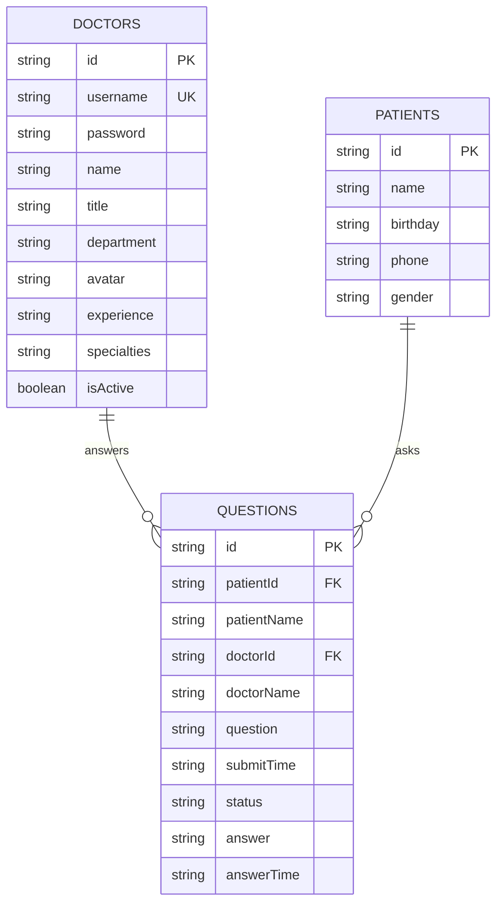
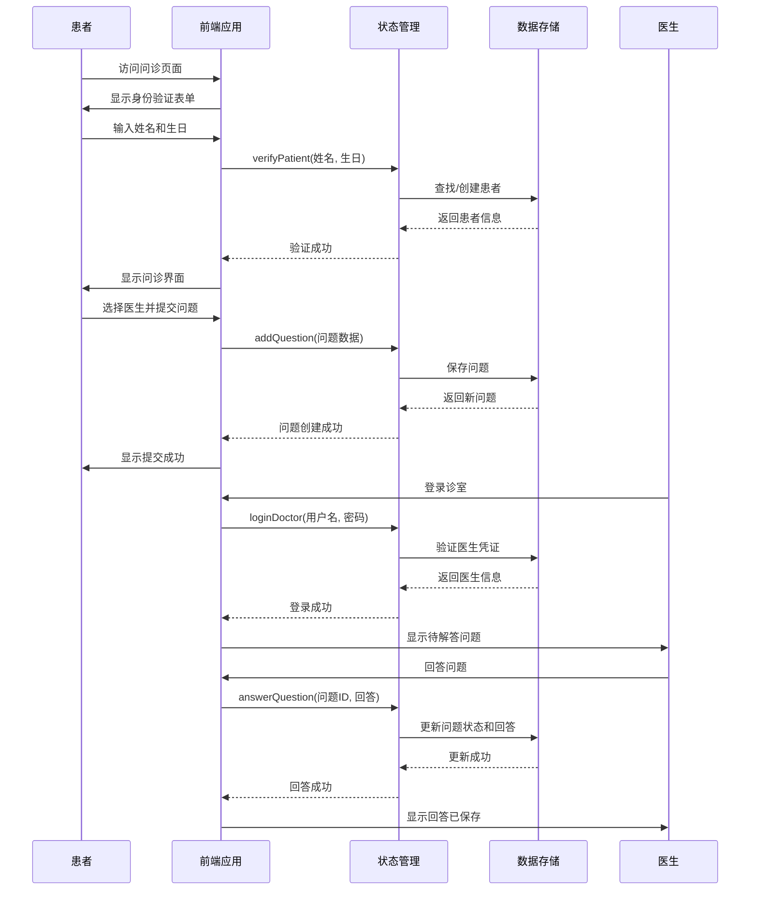
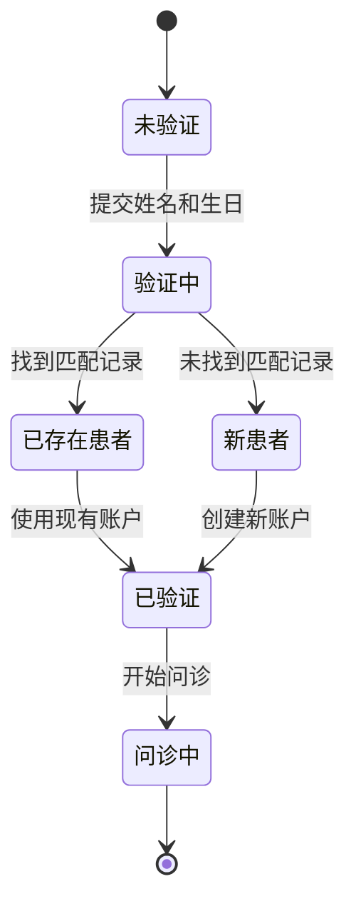

# 数据模型

## 概述
本文档描述了此工作空间的数据模型、关系和数据流。它为AI模型提供了必要的数据结构理解，以便有效地处理代码库。

## 数据库架构

### 概览图


## 实体定义

### 医生实体 (Doctor)
**用途**: 代表系统中的医生用户，包含认证和职业信息。
**位置**: `web/qa-web/src/store/index.ts`

```typescript
export interface Doctor {
  id: string;           // 医生ID，如 "doc001"
  username: string;     // 用户名，如 "dr-zhang-wei"
  password: string;     // 密码（当前为明文存储）
  name: string;        // 医生姓名，如 "张伟医生"
  title: string;       // 职称，如 "主任医师"
  department: string;  // 科室，如 "心内科"
  avatar: string;      // 头像URL
  experience: string;  // 临床经验，如 "15年临床经验"
  specialties: string[]; // 专长领域，如 ["高血压", "冠心病", "心律失常"]
  isActive: boolean;   // 是否在线/活跃
}
```

### 患者实体 (Patient)
**用途**: 代表系统中的患者用户，包含基本身份信息。
**位置**: `web/qa-web/src/store/index.ts`

```typescript
export interface Patient {
  id: string;          // 患者ID，如 "patient001"
  name: string;       // 患者姓名，如 "赵明"
  birthday: string;   // 生日，格式 "YYYY-MM-DD"
  phone: string;      // 电话号码
  gender: string;     // 性别
}
```

### 问题实体 (Question)
**用途**: 代表患者向医生提出的医疗问题及其回答。
**位置**: `web/qa-web/src/store/index.ts`

```typescript
export interface Question {
  id: string;          // 问题ID，如 "q001"
  patientId: string;   // 患者ID
  patientName: string; // 患者姓名
  doctorId: string;    // 医生ID
  doctorName: string;  // 医生姓名
  question: string;    // 问题内容
  submitTime: string;  // 提交时间，ISO格式
  status: 'pending' | 'answered';  // 状态：待解答/已解答
  answer: string | null;  // 医生回答
  answerTime: string | null;  // 回答时间，ISO格式
}
```

## 数据关系

### 一对多关系
1. **医生 → 问题**: 一个医生可以回答多个问题
2. **患者 → 问题**: 一个患者可以提出多个问题

### 数据流
- 患者通过姓名和生日验证身份
- 患者选择医生并提交问题
- 医生登录后查看分配给自己的问题
- 医生回答问题，问题状态更新为"已解答"

## 数据流图

### 问诊流程


### 患者注册/验证流程


## 数据验证规则

### 患者验证
```typescript
const patientValidationRules = {
  name: {
    required: true,
    minLength: 2,
    maxLength: 50,
    pattern: /^[\u4e00-\u9fa5a-zA-Z\s]+$/,  // 中英文和空格
  },
  birthday: {
    required: true,
    pattern: /^\d{4}-\d{2}-\d{2}$/,  // YYYY-MM-DD格式
    validate: (value: string) => {
      const date = new Date(value);
      const today = new Date();
      return date <= today;  // 生日不能晚于今天
    }
  },
};
```

### 医生验证
```typescript
const doctorValidationRules = {
  username: {
    required: true,
    pattern: /^[a-z0-9-]+$/,  // 小写字母、数字和连字符
    minLength: 3,
    maxLength: 50,
  },
  password: {
    required: true,
    minLength: 6,
  },
  name: {
    required: true,
    minLength: 2,
    maxLength: 50,
  },
  department: {
    required: true,
    minLength: 2,
    maxLength: 50,
  },
};
```

### 问题验证
```typescript
const questionValidationRules = {
  question: {
    required: true,
    minLength: 10,
    maxLength: 1000,
  },
  doctorId: {
    required: true,
    pattern: /^doc\d{3}$/,  // doc后跟3位数字
  },
  patientId: {
    required: true,
    pattern: /^patient\d{3}$/,  // patient后跟3位数字
  },
};
```

## 示例数据

### 数据文件位置
- **医生数据**: `web/qa-web/src/data/doctor-user-list.json`
- **患者数据**: `web/qa-web/src/data/patient-user.json`
- **问题数据**: `web/qa-web/src/data/question-list.json`

### 医生示例数据
```json
{
  "id": "doc001",
  "username": "dr-zhang-wei",
  "password": "123456",
  "name": "张伟医生",
  "title": "主任医师",
  "department": "心内科",
  "avatar": "https://images.pexels.com/photos/5215024/pexels-photo-5215024.jpeg?auto=compress&cs=tinysrgb&w=400",
  "experience": "15年临床经验",
  "specialties": ["高血压", "冠心病", "心律失常"],
  "isActive": true
}
```

### 患者示例数据
```json
{
  "id": "patient001",
  "name": "赵明",
  "birthday": "1985-03-15",
  "phone": "138****1234",
  "gender": "男"
}
```

### 问题示例数据
```json
{
  "id": "q001",
  "patientId": "patient001",
  "patientName": "赵明",
  "doctorId": "doc001",
  "doctorName": "张伟医生",
  "question": "最近总是感觉胸闷气短,特别是爬楼梯的时候,这是什么原因?",
  "submitTime": "2025-11-02T09:30:00",
  "status": "answered",
  "answer": "根据您的描述,可能是心脏功能问题。建议您做个心电图和心脏彩超检查,同时注意休息,避免剧烈运动。",
  "answerTime": "2025-11-02T09:45:00"
}
```

## 数据访问模式

### 存储接口
**位置**: `web/qa-web/src/store/index.ts`

```typescript
// 当前项目使用内存存储，通过store对象访问
export const store = {
  state: {
    doctors: Doctor[];
    patients: Patient[];
    questions: Question[];
    currentDoctor: Doctor | null;
    currentPatient: Patient | null;
  };
  
  // 医生相关方法
  loginDoctor(username: string, password: string): Doctor | null;
  logoutDoctor(): void;
  getDoctorByUsername(username: string): Doctor | undefined;
  getActiveDoctors(): Doctor[];
  
  // 患者相关方法
  verifyPatient(name: string, birthday: string): Patient;
  logoutPatient(): void;
  
  // 问题相关方法
  getQuestionsByDoctor(doctorId: string): Question[];
  getQuestionsByPatient(patientId: string): Question[];
  addQuestion(question: Omit<Question, 'id' | 'submitTime' | 'status' | 'answer' | 'answerTime'>): Question;
  answerQuestion(questionId: string, answer: string): void;
  markQuestionAsAnswered(questionId: string): void;
  
  // 统计方法
  getStatistics(): {
    totalDoctors: number;
    totalQuestions: number;
    activeSessions: number;
    totalSessions: number;
  };
}
```

### 查询模式
```typescript
// 获取医生的问题列表
const doctorQuestions = store.getQuestionsByDoctor('doc001');

// 获取患者的问题列表
const patientQuestions = store.getQuestionsByPatient('patient001');

// 查找活跃医生
const activeDoctors = store.getActiveDoctors();

// 按用户名查找医生
const doctor = store.getDoctorByUsername('dr-zhang-wei');
```

## 数据安全

### 当前状态
- **密码存储**: 当前为明文存储（需要改进）
- **数据传输**: 前端状态管理，后端API正在开发中
- **数据持久化**: JSON文件模拟，无数据库
- **后端服务**: Spring Boot微服务架构（qa-service-user, qa-service-question）

### 建议改进
1. **密码加密**: 使用bcrypt或Argon2进行密码哈希
2. **API安全**: 实现JWT认证和HTTPS
3. **数据验证**: 服务器端验证所有输入
4. **审计日志**: 记录重要操作
5. **数据库集成**: 将内存存储迁移到关系型数据库

## 当前实现状态

### 前端实现
- **数据模型定义**: 在 `web/qa-web/src/store/index.ts` 中定义
- **数据存储**: 内存存储，通过Vue reactive状态管理
- **数据源**: JSON文件 (`web/qa-web/src/data/` 目录)
- **接口**: TypeScript接口定义完整

### 后端实现
- **服务架构**: Spring Boot微服务
  - `qa-service-user`: 用户服务（医生和患者管理）
  - `qa-service-question`: 问题服务（问诊管理）
- **当前状态**: 基础框架已搭建，数据模型实体待实现
- **API**: 基础CORS配置已完成

### 数据流
1. **前端数据流**: Vue组件 → Store状态管理 → JSON数据
2. **后端数据流**: 待实现（Spring Boot → 数据库）
3. **前后端通信**: 待实现（REST API）

## 数据迁移策略

### 从JSON文件到数据库
```sql
-- 创建医生表
CREATE TABLE doctors (
  id VARCHAR(20) PRIMARY KEY,
  username VARCHAR(50) UNIQUE NOT NULL,
  password_hash VARCHAR(255) NOT NULL,
  name VARCHAR(100) NOT NULL,
  title VARCHAR(50),
  department VARCHAR(100),
  avatar_url TEXT,
  experience TEXT,
  specialties JSONB,
  is_active BOOLEAN DEFAULT true,
  created_at TIMESTAMP DEFAULT CURRENT_TIMESTAMP,
  updated_at TIMESTAMP DEFAULT CURRENT_TIMESTAMP
);

-- 创建患者表
CREATE TABLE patients (
  id VARCHAR(20) PRIMARY KEY,
  name VARCHAR(100) NOT NULL,
  birthday DATE NOT NULL,
  phone VARCHAR(20),
  gender VARCHAR(10),
  created_at TIMESTAMP DEFAULT CURRENT_TIMESTAMP
);

-- 创建问题表
CREATE TABLE questions (
  id VARCHAR(20) PRIMARY KEY,
  patient_id VARCHAR(20) REFERENCES patients(id),
  patient_name VARCHAR(100) NOT NULL,
  doctor_id VARCHAR(20) REFERENCES doctors(id),
  doctor_name VARCHAR(100) NOT NULL,
  question TEXT NOT NULL,
  submit_time TIMESTAMP NOT NULL,
  status VARCHAR(20) DEFAULT 'pending',
  answer TEXT,
  answer_time TIMESTAMP,
  created_at TIMESTAMP DEFAULT CURRENT_TIMESTAMP
);
```

### 索引优化
```sql
-- 常用查询的索引
CREATE INDEX idx_doctors_username ON doctors(username);
CREATE INDEX idx_doctors_is_active ON doctors(is_active);
CREATE INDEX idx_patients_name_birthday ON patients(name, birthday);
CREATE INDEX idx_questions_doctor_id_status ON questions(doctor_id, status);
CREATE INDEX idx_questions_patient_id ON questions(patient_id);
CREATE INDEX idx_questions_submit_time ON questions(submit_time DESC);
```

## 数据保留策略

### 建议策略
- **患者数据**: 账户活跃期间保留，删除后保留30天
- **医生数据**: 永久保留（医疗记录要求）
- **问题数据**: 永久保留（医疗记录要求）
- **日志数据**: 保留1年

### 数据清理
```sql
-- 软删除患者数据
UPDATE patients SET deleted_at = CURRENT_TIMESTAMP 
WHERE deleted_at IS NULL AND last_active_at < CURRENT_TIMESTAMP - INTERVAL '30 days';

-- 归档旧问题（超过5年）
INSERT INTO questions_archive SELECT * FROM questions 
WHERE submit_time < CURRENT_TIMESTAMP - INTERVAL '5 years';
DELETE FROM questions WHERE submit_time < CURRENT_TIMESTAMP - INTERVAL '5 years';
```

---

*此数据模型文档应在数据库架构或数据结构发生变化时更新。使用`/context-update-instruction`保持本文档最新。*