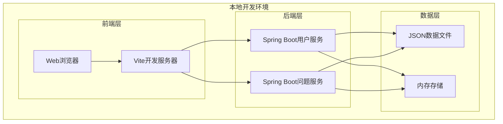

# 部署配置

## 概述
本文档描述了此工作空间的部署架构、配置和流程。它为AI模型提供了理解和处理部署环境所需的信息。

## 部署架构

### 系统架构图


### 组件描述
| 组件 | 用途 | 技术 | 端口 |
|------|------|------|------|
| **Vite开发服务器** | 前端开发服务器 | Vite 5.4.8 | 5173 (默认) |
| **Spring Boot用户服务** | 用户管理后端服务 | Spring Boot 3.5.7 | 8080 (默认) |
| **Spring Boot问题服务** | 问题管理后端服务 | Spring Boot 3.5.7 | 8081 (需配置) |
| **JSON数据文件** | 模拟数据存储 | JSON文件 | - |
| **内存存储** | 运行时状态管理 | Vue reactive store | - |

## 环境配置

### 开发环境
```yaml
# 前端配置 (web/qa-web/.env)
VITE_APP_TITLE=在线医疗问诊平台
VITE_API_BASE_URL=http://localhost:8080
VITE_APP_ENV=development

# 后端用户服务配置 (server/qa-service-user/src/main/resources/application.properties)
server.port=8080
spring.application.name=qa-service-user
spring.profiles.active=dev

# 后端问题服务配置 (server/qa-service-question/src/main/resources/application.properties)
server.port=8081
spring.application.name=qa-service-question
spring.profiles.active=dev
```

### 生产环境建议配置
```yaml
# 前端生产配置 (.env.production)
VITE_APP_TITLE=专业在线医疗问诊平台
VITE_API_BASE_URL=https://api.medical-qa.com
VITE_APP_ENV=production

# 后端用户服务生产配置 (application-prod.properties)
server.port=8080
spring.application.name=qa-service-user
spring.profiles.active=prod

spring.datasource.url=jdbc:postgresql://prod-db:5432/medical_qa
spring.datasource.username=${DB_USERNAME}
spring.datasource.password=${DB_PASSWORD}

spring.jpa.hibernate.ddl-auto=validate
spring.jpa.properties.hibernate.dialect=org.hibernate.dialect.PostgreSQLDialect

logging.level.org.springframework=INFO
logging.level.com.leansofx=DEBUG

# 安全配置
spring.security.oauth2.resourceserver.jwt.issuer-uri=https://auth.medical-qa.com
```

## 部署流程

### 本地开发部署


### 部署步骤

#### 1. 本地开发设置
```bash
# 1. 克隆代码库
git clone <repository-url>
cd qa-live-healthcare

# 2. 启动后端服务
# 用户服务
cd server/qa-service-user
mvn spring-boot:run

# 问题服务（新终端）
cd server/qa-service-question
mvn spring-boot:run

# 3. 启动前端服务
cd web/qa-web
npm install
npm run dev

# 4. 访问应用
# 打开浏览器访问 http://localhost:5173
```

#### 2. 生产部署建议
```bash
# 1. 构建后端服务
cd server/qa-service-user
mvn clean package -DskipTests
# 生成 target/qa-service-user-0.0.1-SNAPSHOT.jar

cd ../qa-service-question
mvn clean package -DskipTests
# 生成 target/qa-service-question-0.0.1-SNAPSHOT.jar

# 2. 构建前端应用
cd web/qa-web
npm run build
# 生成 dist/ 目录

# 3. Docker化部署
# 创建Dockerfile
```

## 基础设施即代码

### Docker配置
```dockerfile
# 后端服务Dockerfile示例
FROM openjdk:17-jdk-slim

WORKDIR /app

# 复制JAR文件
COPY target/qa-service-user-0.0.1-SNAPSHOT.jar app.jar

# 创建非root用户
RUN addgroup --system --gid 1001 appuser && \
    adduser --system --uid 1001 --gid 1001 appuser

USER appuser

# 健康检查
HEALTHCHECK --interval=30s --timeout=3s --start-period=5s --retries=3 \
  CMD curl -f http://localhost:8080/actuator/health || exit 1

EXPOSE 8080

ENTRYPOINT ["java", "-jar", "app.jar"]
```

```dockerfile
# 前端应用Dockerfile示例
FROM nginx:alpine

WORKDIR /usr/share/nginx/html

# 复制构建文件
COPY dist/ .

# 复制nginx配置
COPY nginx.conf /etc/nginx/conf.d/default.conf

# 设置权限
RUN chown -R nginx:nginx /usr/share/nginx/html && \
    chmod -R 755 /usr/share/nginx/html

EXPOSE 80

CMD ["nginx", "-g", "daemon off;"]
```

### Docker Compose配置
```yaml
version: '3.8'

services:
  # 数据库服务
  postgres:
    image: postgres:15-alpine
    environment:
      POSTGRES_DB: medical_qa
      POSTGRES_USER: medical_user
      POSTGRES_PASSWORD: ${DB_PASSWORD}
    volumes:
      - postgres_data:/var/lib/postgresql/data
    ports:
      - "5432:5432"
    healthcheck:
      test: ["CMD-SHELL", "pg_isready -U medical_user"]
      interval: 10s
      timeout: 5s
      retries: 5

  # 用户服务
  user-service:
    build:
      context: ./server/qa-service-user
      dockerfile: Dockerfile
    environment:
      SPRING_PROFILES_ACTIVE: docker
      SPRING_DATASOURCE_URL: jdbc:postgresql://postgres:5432/medical_qa
      SPRING_DATASOURCE_USERNAME: medical_user
      SPRING_DATASOURCE_PASSWORD: ${DB_PASSWORD}
    ports:
      - "8080:8080"
    depends_on:
      postgres:
        condition: service_healthy
    healthcheck:
      test: ["CMD", "curl", "-f", "http://localhost:8080/actuator/health"]
      interval: 30s
      timeout: 10s
      retries: 3

  # 问题服务
  question-service:
    build:
      context: ./server/qa-service-question
      dockerfile: Dockerfile
    environment:
      SPRING_PROFILES_ACTIVE: docker
      SPRING_DATASOURCE_URL: jdbc:postgresql://postgres:5432/medical_qa
      SPRING_DATASOURCE_USERNAME: medical_user
      SPRING_DATASOURCE_PASSWORD: ${DB_PASSWORD}
    ports:
      - "8081:8081"
    depends_on:
      postgres:
        condition: service_healthy

  # 前端应用
  frontend:
    build:
      context: ./web/qa-web
      dockerfile: Dockerfile
    ports:
      - "80:80"
    depends_on:
      - user-service
      - question-service

volumes:
  postgres_data:
```

### Nginx配置
```nginx
# nginx.conf
server {
    listen 80;
    server_name localhost;
    root /usr/share/nginx/html;
    index index.html;

    # Gzip压缩
    gzip on;
    gzip_vary on;
    gzip_min_length 1024;
    gzip_types text/plain text/css text/xml text/javascript application/javascript application/xml+rss application/json;

    # 前端路由支持
    location / {
        try_files $uri $uri/ /index.html;
    }

    # API代理
    location /api/user/ {
        proxy_pass http://user-service:8080/;
        proxy_set_header Host $host;
        proxy_set_header X-Real-IP $remote_addr;
        proxy_set_header X-Forwarded-For $proxy_add_x_forwarded_for;
        proxy_set_header X-Forwarded-Proto $scheme;
    }

    location /api/question/ {
        proxy_pass http://question-service:8081/;
        proxy_set_header Host $host;
        proxy_set_header X-Real-IP $remote_addr;
        proxy_set_header X-Forwarded-For $proxy_add_x_forwarded_for;
        proxy_set_header X-Forwarded-Proto $scheme;
    }

    # 静态资源缓存
    location ~* \.(jpg|jpeg|png|gif|ico|css|js)$ {
        expires 1y;
        add_header Cache-Control "public, immutable";
    }
}
```

## 监控和可观测性

### 健康检查端点
```java
// Spring Boot健康检查配置
@RestController
@RequestMapping("/actuator")
public class HealthController {
    
    @GetMapping("/health")
    public ResponseEntity<Map<String, String>> health() {
        Map<String, String> status = new HashMap<>();
        status.put("status", "UP");
        status.put("timestamp", Instant.now().toString());
        return ResponseEntity.ok(status);
    }
    
    @GetMapping("/ready")
    public ResponseEntity<Map<String, String>> readiness() {
        Map<String, String> status = new HashMap<>();
        // 检查数据库连接等依赖
        status.put("status", "READY");
        return ResponseEntity.ok(status);
    }
}
```

### 日志配置
```properties
# application.properties 中的日志配置
logging.level.root=INFO
logging.level.com.leansofx=DEBUG
logging.level.org.springframework.web=DEBUG
logging.level.org.hibernate.SQL=DEBUG
logging.level.org.hibernate.type.descriptor.sql.BasicBinder=TRACE

# 日志文件配置
logging.file.name=logs/application.log
logging.file.max-size=10MB
logging.file.max-history=7
logging.pattern.file=%d{yyyy-MM-dd HH:mm:ss} [%thread] %-5level %logger{36} - %msg%n
```

## 安全配置

### CORS配置
```java
// CorsConfig.java
@Configuration
public class CorsConfig {
    
    @Bean
    public WebMvcConfigurer corsConfigurer() {
        return new WebMvcConfigurer() {
            @Override
            public void addCorsMappings(CorsRegistry registry) {
                registry.addMapping("/api/**")
                    .allowedOrigins("http://localhost:5173", "https://medical-qa.com")
                    .allowedMethods("GET", "POST", "PUT", "DELETE", "OPTIONS")
                    .allowedHeaders("*")
                    .allowCredentials(true)
                    .maxAge(3600);
            }
        };
    }
}
```

### 安全头配置
```java
// SecurityConfig.java
@Configuration
@EnableWebSecurity
public class SecurityConfig {
    
    @Bean
    public SecurityFilterChain filterChain(HttpSecurity http) throws Exception {
        http
            .csrf(csrf -> csrf.disable())
            .headers(headers -> headers
                .contentSecurityPolicy(csp -> csp
                    .policyDirectives("default-src 'self'; script-src 'self' 'unsafe-inline'; style-src 'self' 'unsafe-inline';")
                )
                .frameOptions(frame -> frame.sameOrigin())
            )
            .authorizeHttpRequests(auth -> auth
                .requestMatchers("/api/public/**").permitAll()
                .requestMatchers("/api/admin/**").hasRole("ADMIN")
                .anyRequest().authenticated()
            )
            .oauth2ResourceServer(oauth2 -> oauth2.jwt(Customizer.withDefaults()));
        
        return http.build();
    }
}
```

## 备份和灾难恢复

### 数据库备份策略
```bash
#!/bin/bash
# scripts/backup-database.sh

# 环境变量
BACKUP_DIR="/backups"
DATE=$(date +%Y%m%d_%H%M%S)
DB_NAME="medical_qa"

# 创建备份目录
mkdir -p $BACKUP_DIR

# 执行备份
pg_dump -h $DB_HOST -U $DB_USER $DB_NAME > $BACKUP_DIR/${DB_NAME}_${DATE}.sql

# 压缩备份
gzip $BACKUP_DIR/${DB_NAME}_${DATE}.sql

# 上传到云存储（可选）
# aws s3 cp $BACKUP_DIR/${DB_NAME}_${DATE}.sql.gz s3://backup-bucket/

# 清理旧备份（保留最近30天）
find $BACKUP_DIR -name "*.sql.gz" -mtime +30 -delete

echo "备份完成: ${DB_NAME}_${DATE}.sql.gz"
```

### 恢复流程
```bash
#!/bin/bash
# scripts/restore-database.sh

# 环境变量
BACKUP_FILE="/backups/medical_qa_20250101_120000.sql.gz"
DB_NAME="medical_qa"

# 停止应用服务
docker-compose stop user-service question-service

# 解压备份文件
gunzip -c $BACKUP_FILE > /tmp/restore.sql

# 恢复数据库
psql -h $DB_HOST -U $DB_USER -d $DB_NAME -f /tmp/restore.sql

# 重启应用服务
docker-compose start user-service question-service

# 清理临时文件
rm /tmp/restore.sql

echo "数据库恢复完成"
```

## 性能优化

### 前端优化
```typescript
// 代码分割和懒加载
const Home = () => import('../views/Home.vue');
const Consultation = () => import('../views/Consultation.vue');

// 图片优化
const optimizedImage = (url: string, width: number, height: number) => {
  return `${url}?w=${width}&h=${height}&fit=crop&auto=format`;
};

// 缓存策略
const cacheConfig = {
  doctorList: 300,  // 5分钟
  questionList: 60, // 1分钟
  userProfile: 1800 // 30分钟
};
```

### 后端优化
```java
// 数据库查询优化
@Repository
public interface QuestionRepository extends JpaRepository<Question, String> {
    
    @Query("SELECT q FROM Question q WHERE q.doctorId = :doctorId AND q.status = 'pending'")
    List<Question> findPendingQuestionsByDoctor(@Param("doctorId") String doctorId);
    
    @Query("SELECT q FROM Question q WHERE q.patientId = :patientId ORDER BY q.submitTime DESC")
    Page<Question> findQuestionsByPatient(@Param("patientId") String patientId, Pageable pageable);
    
    @EntityGraph(attributePaths = {"doctor", "patient"})
    Optional<Question> findWithDetailsById(String id);
}
```

## 部署清单

### 预部署检查
- [ ] 所有测试通过
- [ ] 代码审查完成
- [ ] 安全扫描通过
- [ ] 性能测试完成
- [ ] 数据库迁移测试
- [ ] 回滚计划准备

### 部署期间
- [ ] 首先部署到测试环境
- [ ] 运行冒烟测试
- [ ] 监控指标
- [ ] 验证功能
- [ ] 更新文档

### 部署后
- [ ] 监控错误率
- [ ] 检查性能指标
- [ ] 验证备份
- [ ] 更新部署日志
- [ ] 通知相关方

## 故障排除

### 常见问题

#### 数据库连接问题
```bash
# 检查数据库连接性
nc -zv localhost 5432

# 检查数据库状态
docker exec -it postgres psql -U medical_user -c "\l"

# 检查连接池
SHOW max_connections;
SHOW idle_in_transaction_session_timeout;
```

#### 应用崩溃
```bash
# 检查日志
docker logs -f user-service

# 检查资源使用情况
docker stats

# 检查事件
docker events

# 调试容器
docker exec -it user-service /bin/sh
```

#### 性能问题
```bash
# 检查慢查询
SELECT query, calls, total_time, mean_time
FROM pg_stat_statements
ORDER BY mean_time DESC
LIMIT 10;

# 检查缓存命中率
SELECT 
  sum(heap_blks_read) as heap_read,
  sum(heap_blks_hit)  as heap_hit,
  sum(heap_blks_hit) / (sum(heap_blks_hit) + sum(heap_blks_read)) as ratio
FROM pg_statio_user_tables;
```

---

*此部署文档应在基础设施或部署流程发生变化时更新。使用`/context-update-instruction`保持本文档最新。*