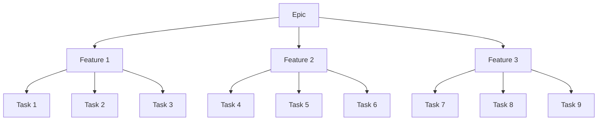

# ASDM Toolset - Spec Builder for Agile Team (Standard version)

toolset-id: spec-builder-agile-standard
toolset-name: Spec Builder for Agile Team (Standard version)
version: 0.0.1
updated-date: 2025-12-7
toolset-description: Spec Builder for Agile Team (Standard version) is a toolset for building specification documents for a Software Development team who is using Agile methodology.

## Overview

Spec Builder is a toolset for building specification documents for a Software Development team who is using Agile methodology. In `ASDM`, we provide different versions of `Spec Builder`, the `Lite version` is a light-weighted version of `Spec Builder`, which is designed to be used in a team who is using Agile methodology, and also using a light-weighted process to manage their work.

The full sets of `Spec Builder` is available at [Spec Builder](https://github.com/a-sdm/toolset-spec-builder), we provide the following versions to address differenet complexicity of the team and projects. The choice of the version depends on the complexity of the team and projects. For example, if the team is 5-7 people and only working on a small-scale project, the `Lite version` is a good choice. If the team is 10-20 people and working on a large-scale project, the `Agile Full version` is a good choice.

- `Agile Lite version`: designed to be used in a team who is using Agile methodology, and also using a light-weighted process to manage their work.
- `Agile Standard version`: designed to be used in a team who is using Agile methodology, and also using a standard process to manage their work.
- `Agile Full version`: designed to be used in a team who is using Agile methodology, and also using a full-featured process to manage their work.

> Note: we DO NOT provide a `Waterfall version`, because Waterfall is simply not a good process to work on a software project. Just kidding! Even if you are a Waterfall team, you can still use `Spec Builder` to build specification documents for your project although we believe every software project should be Agile.

User can install this `toolset` into a workspace and run `INSTALL.md` document using `AI Guided Installation` to initialize the toolset for the workspace. Just simply copy and paste the following prompt into your `AI Coding` tool's chat window and hit enter:

```shell
Follow instructions in .asdm/toolsets/spec-builder-agile-standard/INSTALL.md
```

## Features

Main features of Spec Builder:

- Provide user friendly shortcuts `instructions` using provider's entry point to ease the process of building specification documents
- Provide standard `templates` for building specification documents, and allow user admin (Project Manager, Product Manager, Product Owner) to define their own process by customize the templates
- Allow `context injection` using the `context-buider` toolset to allow this toolset to work with different codebase and projects.
- Build specification documents for a workspace, e.g. PRD documents for a epic, feature, task etc.
- Build specification documents for a specific epic, feature, task etc.

How `context injection` works:

This process will allow `Spec Builder` to work with different codebase and projects with consistent template and instructions.

- User can install `context-builder` toolset into a workspace, and run `INSTALL.md` document to initialize the toolset for the workspace.
- `context-builder` will build context for a workspace and save to `.asdm/contexts/` directory
- `Spec Builder` will load context from `.asdm/contexts/` directory and use it to build specification documents
- `Spec Builder` will save generated documents to `.asdm/specs/` directory which is based on the injected context

## Toolset Installation Process

`INSTALL.md` will setup the toolset with the following steps:

- Create `.asdm/specs` directory for Spec Builder's workspace
- Check if dependency toolset `context-builder` is installed, if not install and initialize it. This will ensure that Spec Builder can work with different codebase and projects.
- Detect the current `Agentic Engine` provider, e.g. Claude Code, GitHub Copilot, Tencent CodeBuddy etc. （Use hard-coded provider name for now, e.g. CodeBuddy ）
- Create shortcuts commands for `Spec Builder` in provider's entry point, e.g. `.claude/commands`, `.github/prompts`, `.codebuddy/commands` etc.

## Toolset Workflow

Once `Spec Builder` is installed, user can use the following commands to build specification documents for a workspace:

- `/epic-prd-generation-instruction {epic description}`: build PRD document for a epic
- `/feature-prd-generation-instruction {epic document path} {additional prompt for feature generation}`: build PRD document for a feature
- `/task-generation-instruction {feature document path} {additional prompt for task generation}`: build task document for a feature

This workflow is based on the assumption that the team that's using this `Spec Builder` is a `Scrum` like agile team and using the terms `epic`, `feature`, `task` to describe the work that's being done. The normal work struction in such team is like this:

- User creates an epic based on `User Requirements` which describe a set of scenarios that the user wants to achieve.
- User creates a feature based on `epic`, which is a set of tasks that need to be done to achieve the epic.
- User creates a task based on `feature`, which is a set of steps that need to be done to achieve the feature.

The hierarchy of the work is like this, described in a mermaid diagram to illustrate the hierarchy of 1 epic with 3 features, each with 3 tasks:




## Toolset Structure 

```
.asdm/toolsets/spec-builder-agile-standard
├── README.md                                   ## Current file
├── INSTALL.md                                  ## Installation Document for AI Model, contains prompts to instruct AI Model to install the toolset
├── templates                                   ## Document Templates for Spec Builder
│   ├── README.md                               ## README.md for AI Model to understand what templates are available
│   ├── epic-prd-template.md                    ## PRD tempalte for epic level requirements, user can use this tempalte to build PRD documents for a epic
│   ├── feature-prd-template.md                 ## PRD tempalte for feature level requirements, user can use this tempalte to build features from a specific epic
│   └── task-template.md                        ## Task tempalte for task level requirements, user can use this tempalte to build Task documents from a specific feature
├── instructions                                ## Instructions for Spec Builder
│   ├── README.md                               ## README.md for AI Model to understand what instructions are available
│   ├── epic-prd-generation-instruction.md      ## Instruction for building PRD documents for a epic, which is using epic-prd-template.md as a template and instruct AI Model to generate a PRD document for a epic
│   └── feature-prd-generation-instruction.md   ## Instruction for building PRD documents for a feature, which is using feature-prd-template.md as a template and instruct AI Model to generate a PRD document for a feature. it should also use generated epic document as the input. 
│   └── task-generation-instruction.md          ## Instruction for building task documents for a feature, which is using task-template.md as a template and instruct AI Model to generate a task document for a feature. it should also use generated feature document as the input. 
```

## Toolset Workspace

Here is an example of a toolset workspace to be inititalized by `INSTALL.md`, the workspace will be created under `.asdm/specs` directory and used by the `instructions` to place the generated documents. The workspace will provide a standard structure for Spec Builder to work with. This standard will guide AI Model to generate documents in a standard format, also ease the process of Spec Builder to work with different external systems, e.g. GitHub Issues, Jira Tasks, Confluence Pages etc.

```
.asdm/specs
├── {epic-number}_{epic-name}                   ## folder that contains all documents for a epic, e.g. 001-epic-user-registration
│   ├── epic-prd.md                             ## PRD document for a epic, e.g. 001-epic-user-registration-prd.md
│   ├── {feature-number}_{feature-name}         ## folder that contains all documents for a feature, e.g. E001F001-user-registration
│   │   ├── feature-prd.md                      ## PRD document for a feature, e.g. E001F001-user-registration.md
│   │   ├── {task-number}_{task-name}.md        ## Task document for a task, e.g. E001F001T001-user-registration-prd.md
```


## [TODO] External System Integration

> TODO: this integration is not provided by default. The team admin can extend this toolset to achieve this integration.

Spec Builder will be able to work with different external systems, e.g. GitHub Issues, Jira Tasks, Confluence Pages etc. The integration will be done by using `MCP Servers` which provide external system integration.

## Copyright & License

Copyright (c) 2022 LeansoftX.com. All rights reserved.

Licensed under the PROPRIETARY SOFTWARE LICENSE. See [LICENSE](LICENSE) in the project root for license information.
